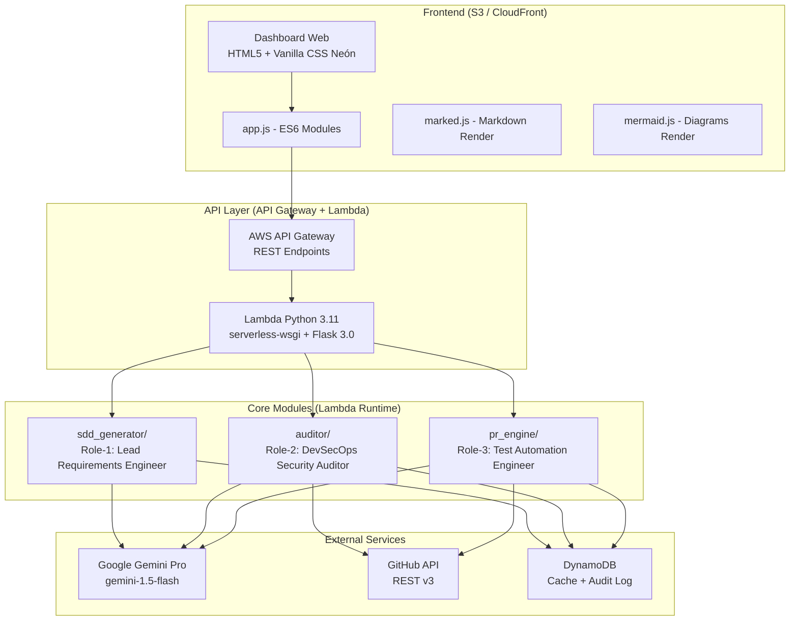
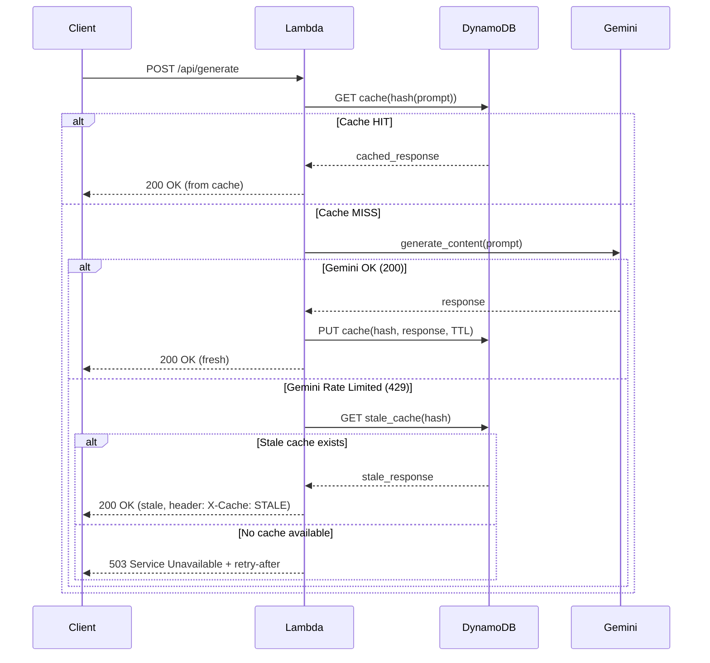
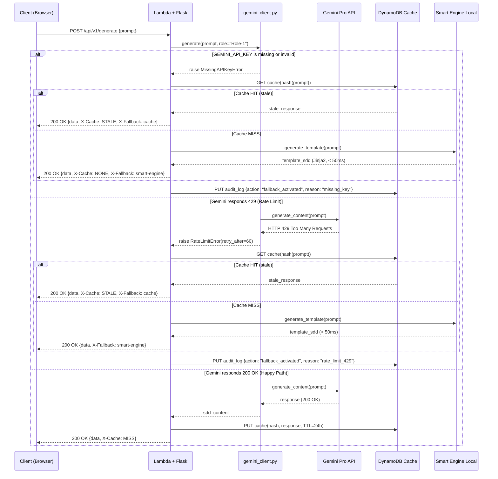
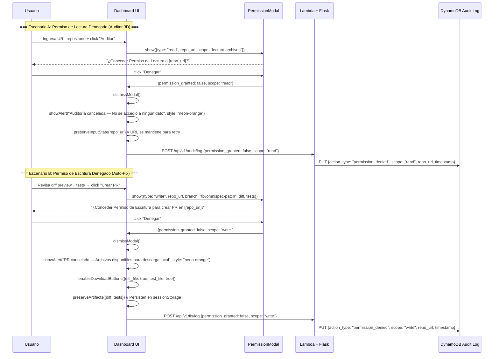
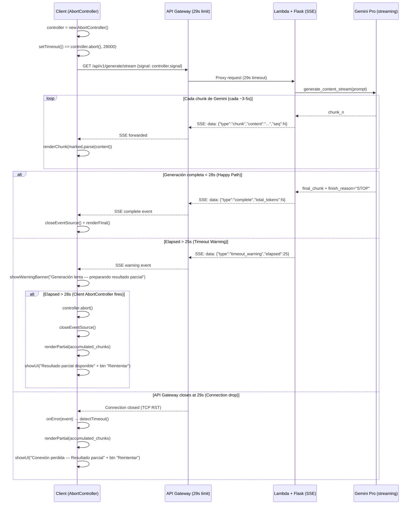

# OmniSpec AI — Design Document

> Arquitectura: Web UI-First (Vanilla CSS Neón Dark Mode + JavaScript ES6)
> Trazabilidad: Vinculado a `requirements.md` (REQ-1.x, REQ-2.x, REQ-3.x)
> Gobernanza: Conforme a `AGENTS.md`

---

## 1. Arquitectura General

### 1.1 Diagrama de Arquitectura (Mermaid.js)



### 1.2 Principios Arquitectónicos

| Principio | Aplicación |
|-----------|-----------|
| UI-First | El frontend define la experiencia; el backend es un servidor de capacidades |
| Serverless | Sin servidores que mantener; escalado automático por request |
| Stateless API | Cada request es independiente; estado persistido en DynamoDB |
| Mínimo Privilegio | Cada Lambda tiene IAM role con permisos mínimos para su función |
| Cache-First | Respuestas de Gemini Pro cacheadas en DynamoDB para resiliencia |

---

## 2. Arquitectura Web UI-First

### 2.1 Stack Frontend

| Tecnología | Propósito | CDN |
|-----------|-----------|-----|
| HTML5 semántico | Estructura y accesibilidad | — |
| Vanilla CSS (Neón Dark Mode) | Estilos sin frameworks | — |
| JavaScript ES6+ | Lógica de interacción (modules, fetch, async/await) | — |
| marked.js | Renderizado de Markdown en tiempo real | `cdn.jsdelivr.net/npm/marked/marked.min.js` |
| mermaid.js | Renderizado de diagramas de arquitectura | `cdn.jsdelivr.net/npm/mermaid/dist/mermaid.min.js` |

### 2.2 Tema Visual Neón Dark Mode

```css
:root {
    --bg-primary: #0a0a0f;
    --bg-secondary: #12121a;
    --bg-card: #1a1a2e;
    --neon-cyan: #00f5ff;
    --neon-magenta: #ff00ff;
    --neon-green: #39ff14;
    --neon-orange: #ff6600;
    --neon-red: #ff0040;
    --text-primary: #e0e0e0;
    --text-secondary: #a0a0b0;
    --border-glow: 0 0 10px var(--neon-cyan), 0 0 20px rgba(0, 245, 255, 0.3);
    --font-mono: 'JetBrains Mono', 'Fira Code', monospace;
    --font-sans: 'Inter', system-ui, sans-serif;
    --radius: 8px;
    --transition: all 0.3s cubic-bezier(0.4, 0, 0.2, 1);
}
```

### 2.3 Componentes UI Reutilizables

| Componente | Descripción | Usado en |
|-----------|-------------|----------|
| `TabPanel` | Sistema de pestañas con indicador neón animado | Dashboard principal |
| `PermissionModal` | Diálogo Human-in-the-Loop con botones Conceder/Denegar | US-2 (REQ-2.1), US-3 (REQ-3.3) |
| `StreamingPanel` | Panel de renderizado incremental para respuestas Gemini | US-1 (REQ-1.1) |
| `DiffViewer` | Vista de diff con syntax highlighting (verde/rojo) | US-3 (REQ-3.1) |
| `ScoreGauge` | Indicador circular de score 0-100 con colores semáforo | US-2 (REQ-2.5) |
| `MermaidBlock` | Contenedor que auto-renderiza bloques ```mermaid | US-1 (REQ-1.3) |

---

## 3. Matriz de System Prompts — Roles Agénticos Gemini Pro

### 3.1 Role-1: Lead Requirements Engineer

**Activación**: Módulo `sdd_generator/` — Requisitos REQ-1.1 a REQ-1.6

```
SYSTEM PROMPT — Role-1: Lead Requirements Engineer

You are a Lead Requirements Engineer specialized in:
- EARS (Easy Approach to Requirements Syntax) specification writing
- AWS Serverless Architecture design (Lambda, API Gateway, DynamoDB, S3)
- Software Design Document (SDD) generation

Your responsibilities:
1. Generate functional requirements using STRICT EARS syntax patterns:
   - Ubiquitous: "The system shall <response>."
   - Event-Driven: "When <trigger>, the system shall <response>."
   - State-Driven: "While <state>, the system shall <response>."
   - Unwanted Behavior: "If <condition>, then the system shall <response>."
   - Optional: "Where <feature> is supported, the system shall <response>."

2. Produce a Mermaid.js architecture diagram showing AWS serverless components.

3. Create a Decision Matrix classifying items as:
   - [AMB] = Ambiguity detected — needs clarification
   - [GAP] = Specification gap — needs new requirement

4. Generate a traceable task plan where each task references REQ-x.x identifiers.

Output format: Structured Markdown with clear section headers.
Language: Match the user's input language.
Traceability: Every generated artifact MUST reference requirement IDs.
```

**Parámetros de generación:**

| Parámetro | Valor |
|-----------|-------|
| model | `gemini-1.5-flash` |
| temperature | 0.7 |
| max_output_tokens | 8192 |
| top_p | 0.9 |
| top_k | 40 |

---

### 3.2 Role-2: DevSecOps Security Auditor

**Activación**: Módulo `auditor/` — Requisitos REQ-2.1 a REQ-2.6

```
SYSTEM PROMPT — Role-2: DevSecOps Security Auditor

You are a DevSecOps Security Auditor specialized in:
- AWS cloud security assessment (IAM, Security Groups, KMS, Secrets Manager)
- Infrastructure-as-Code (IaC) security scanning (CloudFormation, CDK, Terraform)
- Secret detection and credential exposure analysis
- CIS Benchmarks and AWS Well-Architected Framework compliance

Your responsibilities:
1. Evaluate security findings with contextual risk explanations:
   - What is the vulnerability
   - Why it matters (business impact)
   - How to remediate (specific code/config change)

2. Classify findings by severity:
   - CRITICAL (score penalty: 20): Exposed secrets, admin wildcard access
   - HIGH (score penalty: 10): Open security groups, missing encryption
   - MEDIUM (score penalty: 5): Missing tags, overly broad permissions
   - LOW (score penalty: 2): Naming convention violations, missing docs

3. Calculate Security Score using weighted formula:
   Score = 100 - (secrets_penalty * 0.5 + iac_penalty * 0.3 + governance_penalty * 0.2)

4. Provide remediation guidance that is:
   - Actionable (specific file + line + change)
   - Contextual (explains WHY in business terms)
   - Accessible (understandable without deep security expertise)

Output format: Structured JSON for programmatic consumption + Markdown summary.
Reference: CIS AWS Foundations Benchmark v1.5, AWS Well-Architected Security Pillar.
```

**Parámetros de generación:**

| Parámetro | Valor |
|-----------|-------|
| model | `gemini-1.5-flash` |
| temperature | 0.3 |
| max_output_tokens | 4096 |
| top_p | 0.8 |
| top_k | 20 |

---

### 3.3 Role-3: Test Automation Engineer

**Activación**: Módulo `pr_engine/` — Requisitos REQ-3.1 a REQ-3.5

```
SYSTEM PROMPT — Role-3: Test Automation Engineer

You are a Test Automation Engineer specialized in:
- Security patch generation (unified diff format)
- Python pytest unit test authoring
- GitHub Pull Request workflow automation
- TDD (Test-Driven Development) methodology

Your responsibilities:
1. Generate unified diff patches that:
   - Fix ONLY the identified vulnerability (minimal change principle)
   - Are valid and applicable with `git apply`
   - Include inline comments explaining the fix

2. Generate pytest test file `test_security_patch.py` that:
   - Uses pytest framework with fixtures and parametrize
   - Includes positive test (fix applied correctly)
   - Includes negative test (vulnerability no longer exploitable)
   - Is executable with `pytest test_security_patch.py --tb=short -q`
   - Uses unittest.mock for external dependencies

3. Structure the Pull Request body with:
   - Summary of findings addressed
   - Diff applied (code block)
   - Test results evidence
   - Risk assessment before/after

Commit message format: `fix(security): <brief description of finding>`
Branch naming: `fix/omnispec-patch`
Test naming: `test_<function>_<scenario>_<expected_result>`
```

**Parámetros de generación:**

| Parámetro | Valor |
|-----------|-------|
| model | `gemini-1.5-flash` |
| temperature | 0.2 |
| max_output_tokens | 6144 |
| top_p | 0.85 |
| top_k | 30 |

---

## 4. Estrategia de Resiliencia: Caché DynamoDB

### 4.1 Problema

Google Gemini Pro impone rate limits (429 Too Many Requests) y las API Keys tienen cuotas. Sin mitigación, la aplicación se degrada bajo carga.

### 4.2 Solución: Cache-Aside Pattern con DynamoDB



### 4.3 Esquema DynamoDB — Tabla `omnispec-cache`

| Atributo | Tipo | Descripción |
|----------|------|-------------|
| `pk` (Partition Key) | String | `CACHE#{sha256(prompt+model+role)}` |
| `sk` (Sort Key) | String | `v#{version}` |
| `response_body` | String | Respuesta completa de Gemini Pro (comprimida gzip) |
| `model` | String | Modelo usado (`gemini-1.5-flash`) |
| `role` | String | System prompt role (`Role-1`, `Role-2`, `Role-3`) |
| `created_at` | Number | Unix timestamp de creación |
| `ttl` | Number | TTL DynamoDB (Unix timestamp de expiración) |
| `hit_count` | Number | Contador de cache hits |
| `token_count` | Number | Tokens consumidos en la generación original |

### 4.4 Políticas de TTL

| Tipo de Cache | TTL | Justificación |
|---------------|-----|---------------|
| SDD Generation (Role-1) | 24 horas | Specs no cambian frecuentemente |
| Audit Findings (Role-2) | 1 hora | Repos cambian; findings deben ser frescos |
| Fix Generation (Role-3) | Sin cache | Cada fix es único al contexto del hallazgo |
| Stale fallback | 7 días | Para mitigación de rate limits prolongados |

### 4.5 Esquema DynamoDB — Tabla `omnispec-audit-log`

| Atributo | Tipo | Descripción |
|----------|------|-------------|
| `pk` (Partition Key) | String | `USER#{user_id}` |
| `sk` (Sort Key) | String | `ACTION#{timestamp}#{action_type}` |
| `action_type` | String | `permission_read`, `permission_write`, `audit_start`, `pr_created` |
| `repo_url` | String | URL del repositorio GitHub |
| `permission_granted` | Boolean | Si el usuario concedió permiso |
| `metadata` | Map | Datos adicionales del evento |
| `ttl` | Number | 90 días retención para compliance |

---

## 5. Dashboard Web — Layout de 3 Pestañas

### 5.1 Estructura General

```
┌─────────────────────────────────────────────────────────────┐
│  ◆ OmniSpec AI                              [user@github]   │
├─────────────────────────────────────────────────────────────┤
│  ┌──────────┐  ┌──────────────┐  ┌────────────┐            │
│  │ ⚡ SDD    │  │ 🔍 Auditor   │  │ 🔧 Auto-Fix │            │
│  │ Generator │  │ 3D           │  │ Engine     │            │
│  └──────────┘  └──────────────┘  └────────────┘            │
├─────────────────────────────────────────────────────────────┤
│                                                             │
│                   [CONTENT AREA]                            │
│                                                             │
└─────────────────────────────────────────────────────────────┘
```

### 5.2 Tab 1: SDD Generator (vinculado a US-1)

| Zona | Contenido | Requisito |
|------|-----------|-----------|
| Input Panel (izq) | Textarea para descripción del proyecto + input URL repo | REQ-1.1 |
| Action Bar | Botón "Generar SDD" + Botón "Exportar .kiro Pack" | REQ-1.1, REQ-1.6 |
| Output Panel (der) | Streaming markdown con `marked.js` render | REQ-1.1, REQ-1.2 |
| Diagram Section | Bloque Mermaid.js auto-renderizado | REQ-1.3 |
| Matrix Section | Tabla [AMB]/[GAP] colapsable | REQ-1.4 |
| Tasks Section | Checklist de tareas trazables | REQ-1.5 |

### 5.3 Tab 2: Auditor 3D (vinculado a US-2)

| Zona | Contenido | Requisito |
|------|-----------|-----------|
| Input Panel | Input URL repositorio GitHub + selector de alcance | REQ-2.1 |
| Permission Modal | Diálogo "Conceder Permiso de Lectura" con scope visible | REQ-2.1 |
| Score Display | Gauge circular 0-100 con colores semáforo | REQ-2.5 |
| Findings - Secrets | Lista de secretos detectados (metadata only, no values) | REQ-2.2 |
| Findings - IaC | Lista de misconfigurations en infra | REQ-2.3 |
| Findings - Governance | Lista de incumplimientos de gobierno | REQ-2.4 |
| Risk Explanations | Panel expandible con explicaciones Gemini por hallazgo | REQ-2.6 |

### 5.4 Tab 3: Auto-Fix Engine (vinculado a US-3)

| Zona | Contenido | Requisito |
|------|-----------|-----------|
| Findings Selector | Checkboxes para seleccionar hallazgos a corregir | REQ-3.1 |
| Diff Preview | Vista de diff con syntax highlighting | REQ-3.1 |
| Test Preview | Código `test_security_patch.py` con highlighting | REQ-3.2 |
| Permission Modal | Diálogo "Conceder Permiso de Escritura" | REQ-3.3 |
| PR Status | Indicador de progreso: branch → commit → PR → link | REQ-3.4 |
| Test Results | Output de pytest con pass/fail indicators | REQ-3.5 |

---

## 6. API Endpoints

### 6.1 Rutas REST

| Método | Endpoint | Módulo | Descripción | Auth |
|--------|----------|--------|-------------|------|
| POST | `/api/v1/generate` | sdd_generator | Genera SDD spec completa | API Key |
| POST | `/api/v1/generate/export` | sdd_generator | Exporta Pack .kiro (ZIP) | API Key |
| POST | `/api/v1/audit` | auditor | Inicia auditoría 3D | API Key + Read Permission |
| GET | `/api/v1/audit/{id}/status` | auditor | Estado de auditoría en curso | API Key |
| GET | `/api/v1/audit/{id}/report` | auditor | Obtiene reporte completo | API Key |
| POST | `/api/v1/fix/generate` | pr_engine | Genera diff + tests | API Key |
| POST | `/api/v1/fix/apply` | pr_engine | Crea branch + PR | API Key + Write Permission |
| GET | `/api/v1/fix/{id}/status` | pr_engine | Estado del PR creado | API Key |

### 6.2 Flujo de Autenticación

```
Client → API Gateway (API Key validation) → Lambda → Module Logic
                                                    ↓
                                              DynamoDB (audit log)
```

---

## 7. Decisiones de Diseño

| ID | Decisión | Alternativa Descartada | Justificación |
|----|----------|----------------------|---------------|
| DD-1 | Vanilla CSS (no Tailwind/Bootstrap) | Tailwind CSS | Menor bundle size, control total del tema neón, sin build step |
| DD-2 | Flask (no FastAPI) | FastAPI | Compatibilidad nativa con serverless-wsgi, equipo con experiencia Flask |
| DD-3 | DynamoDB (no Redis) | ElastiCache Redis | Serverless nativo, pay-per-request, sin cluster management |
| DD-4 | CDN libs (marked/mermaid) | npm bundled | Sin build pipeline frontend, carga inmediata, cache browser |
| DD-5 | gemini-1.5-flash (no pro) | gemini-1.5-pro | Mejor latencia, menor costo, suficiente para generación de specs |
| DD-6 | Unified diff (no patch object) | JSON patch format | Compatible con `git apply`, legible por humanos, estándar en PRs |
| DD-7 | Human-in-the-Loop modal | Auto-apply | Seguridad obligatoria; nunca modificar repos sin consentimiento explícito |

---

## 8. Diagramas de Secuencia — Casos Borde y Brechas

### 8.1 [GAP-1] Ausencia de API Key / Rate Limit 429 — Flujo de Fallback



**Nota de diseño**: El Smart Engine local usa templates Jinja2 pre-compilados que generan un SDD esqueleto con secciones EARS vacías que el usuario puede completar manualmente. Latencia objetivo: < 50 ms sin red.

---

### 8.2 [GAP-2] Permiso Denegado por Usuario — Flujo UI



**Estados UI post-denegación:**

| Tab | Permiso Denegado | Estado Visual | Acciones Disponibles |
|-----|-----------------|---------------|---------------------|
| Auditor 3D | Lectura | Input preservado, alerta naranja, sin resultados | Reintentar, Cambiar URL |
| Auto-Fix | Escritura | Diff + Tests visibles, botones descarga activos | Descargar Diff, Descargar Tests, Reintentar |

---

### 8.3 [EDGE-1] Timeout API Gateway (29s) — Streaming SSE con AbortController



**Implementación Flask SSE:**

```python
# src/api/routes/generator.py
from flask import Response, stream_with_context

@generator_bp.route('/api/v1/generate/stream', methods=['GET'])
def generate_stream():
    prompt = request.args.get('prompt')

    def event_stream():
        start = time.time()
        for chunk in gemini_client.stream_generate(prompt, role="Role-1"):
            elapsed = time.time() - start
            yield f"data: {json.dumps({'type': 'chunk', 'content': chunk, 'elapsed': elapsed})}\n\n"

            if elapsed > 25:
                yield f"data: {json.dumps({'type': 'timeout_warning', 'elapsed': elapsed})}\n\n"

        yield f"data: {json.dumps({'type': 'complete'})}\n\n"

    return Response(
        stream_with_context(event_stream()),
        mimetype='text/event-stream',
        headers={'Cache-Control': 'no-cache', 'X-Accel-Buffering': 'no'}
    )
```

**Implementación JavaScript AbortController:**

```javascript
// frontend/js/app.js
async function streamGenerate(prompt) {
    const controller = new AbortController();
    const timeoutId = setTimeout(() => controller.abort(), 28000);
    let accumulated = '';

    try {
        const response = await fetch(`/api/v1/generate/stream?prompt=${encodeURIComponent(prompt)}`, {
            signal: controller.signal
        });

        const reader = response.body.getReader();
        const decoder = new TextDecoder();

        while (true) {
            const { done, value } = await reader.read();
            if (done) break;

            const text = decoder.decode(value);
            const events = parseSSE(text);

            for (const event of events) {
                if (event.type === 'chunk') {
                    accumulated += event.content;
                    renderMarkdown(accumulated);  // marked.js incremental
                } else if (event.type === 'timeout_warning') {
                    showWarningBanner(event.elapsed);
                } else if (event.type === 'complete') {
                    clearTimeout(timeoutId);
                    renderFinal(accumulated);
                }
            }
        }
    } catch (err) {
        if (err.name === 'AbortError') {
            renderPartial(accumulated);
            showRetryButton(prompt);
        }
    }
}
```

---

## 9. Matriz de Mitigación de Errores por Rol Agéntico

### 9.1 Role-1: Lead Requirements Engineer — Mitigación de Errores

| Error / Caso Borde | Detección | Mitigación | Fallback | AC Vinculado |
|---------------------|-----------|-----------|----------|--------------|
| Input vago (< 5 palabras) | `len(prompt.split()) < 5` | Gemini expande con inferencia de dominio, genera sección [AMB] | Template SDD genérico con placeholders | AC-AMB-1.1 |
| Gemini API Key ausente | `os.environ.get('GEMINI_API_KEY') is None` | Smart Engine local (Jinja2 templates) | SDD esqueleto sin IA en < 50 ms | AC-GAP-1.1 |
| Gemini 429 Rate Limit | `response.status_code == 429` | Cache DynamoDB (stale) → Smart Engine si cache miss | Respuesta stale + banner OFFLINE | AC-GAP-1.2 |
| Gemini 500/502/503 | `response.status_code in (500, 502, 503)` | Retry x1 con exponential backoff (2s) | Cache/Smart Engine tras segundo fallo | AC-GAP-1.1 |
| Timeout > 25s | `time.time() - start > 25` | SSE timeout_warning event al cliente | Render parcial + botón Reintentar | AC-EDGE-1.5 |
| Respuesta Gemini mal formada | JSON/Markdown parsing error | Reintentar con prompt simplificado | Retornar raw text sin formateo | AC-1.1.1 |
| Output sin patrón EARS | EARS validator no detecta patrones | Re-prompt con instrucción reforzada de formato | Marcar sección con [AMB] "Formato pendiente" | AC-1.2.1 |

### 9.2 Role-2: DevSecOps Security Auditor — Mitigación de Errores

| Error / Caso Borde | Detección | Mitigación | Fallback | AC Vinculado |
|---------------------|-----------|-----------|----------|--------------|
| Permiso de lectura denegado | `permission_granted == false` | Abort inmediato, alerta UI, log en DynamoDB | Mostrar estado limpio sin datos | AC-2.1.2, AC-GAP-2.1 |
| GitHub API 401 Unauthorized | `response.status_code == 401` | Solicitar re-autenticación de token | Mensaje "Token inválido o expirado" | AC-2.1.1 |
| GitHub API 404 Not Found | `response.status_code == 404` | Validar URL format antes de llamar | "Repositorio no encontrado o privado" | AC-2.1.1 |
| GitHub API 403 Rate Limit | `X-RateLimit-Remaining: 0` | Esperar `X-RateLimit-Reset` timestamp | Mostrar countdown + sugerir token personal | AC-2.2.1 |
| Repo vacío (0 archivos) | `len(analyzable_files) == 0` | Retornar score N/A con mensaje explicativo | Lista de extensiones encontradas | AC-EDGE-2.1 |
| Archivo > 256 KB | `file.size > 262144` | Skip + log en sección "Archivos Omitidos" | Analizar solo metadata (nombre, extensión) | AC-EDGE-2.2 |
| Regex pattern match en binarios | File type detection (magic bytes) | Skip archivos binarios automáticamente | Incluir en "Archivos Omitidos" | AC-EDGE-2.4 |
| Gemini 429 durante explicación | `response.status_code == 429` | Cache de explicaciones previas similares | Texto genérico: "Riesgo de seguridad detectado" | AC-2.6.1 |
| Score < 0 (overflow de penalties) | `calculated_score < 0` | Clamp a 0 | Score = 0 con nota "Múltiples hallazgos críticos" | AC-2.5.1 |

### 9.3 Role-3: Test Automation Engineer — Mitigación de Errores

| Error / Caso Borde | Detección | Mitigación | Fallback | AC Vinculado |
|---------------------|-----------|-----------|----------|--------------|
| Permiso de escritura denegado | `write_permission_granted == false` | Abort PR, habilitar descarga local de artefactos | Diff + Tests disponibles offline | AC-3.3.2, AC-GAP-2.4 |
| Diff generado inválido | `git apply --check` falla | Re-generar con contexto de error + archivo completo | Mostrar diff para corrección manual | AC-3.1.1 |
| Tests generados no compilan | `pytest --collect-only` falla | Re-generar tests con traceback como contexto | Ofrecer descarga de diff sin tests | AC-3.2.3 |
| pytest execution fails | Exit code != 0 | Mostrar output pytest + ofrecer regeneración | NO crear PR; mostrar error al usuario | AC-3.5.2 |
| GitHub API: branch ya existe | `422 Reference already exists` | Append timestamp: `fix/omnispec-patch-{ts}` | Intentar con nombre alternativo | AC-3.4.1 |
| GitHub API: PR creation fails | `response.status_code != 201` | Retry x1; si falla, ofrecer manual push instructions | Git commands para ejecución manual | AC-3.4.4 |
| Gemini genera fix incompleto | Diff no cubre todos los hallazgos seleccionados | Re-prompt por hallazgo individual | Generar fixes parciales + avisar pendientes | AC-3.1.2 |
| Token GitHub sin scope `repo` | `403 Resource not accessible` | Informar scopes requeridos al usuario | Instrucciones para crear token con scope correcto | AC-3.4.4 |

---

## 10. Resumen de Decisiones de Resiliencia

| ID | Decisión | Impacto | Latencia Máxima |
|----|----------|---------|-----------------|
| RES-1 | Smart Engine local (Jinja2) como fallback de Gemini | Servicio nunca se cae completamente | 50 ms |
| RES-2 | DynamoDB stale cache con TTL de 7 días | Respuestas disponibles bajo rate limit | 50 ms |
| RES-3 | SSE streaming con chunks cada 5s | Evita timeout 29s de API Gateway | N/A (streaming) |
| RES-4 | AbortController con timeout 28s en cliente | Recuperación graceful ante desconexión | 28s max |
| RES-5 | Preservación de artefactos en sessionStorage | Nada se pierde si usuario deniega permiso | Instantáneo |
| RES-6 | Branch naming con timestamp fallback | Evita conflictos de branches existentes | N/A |
| RES-7 | Score clamped [0, 100] | Previene overflow visual en ScoreGauge | N/A |
