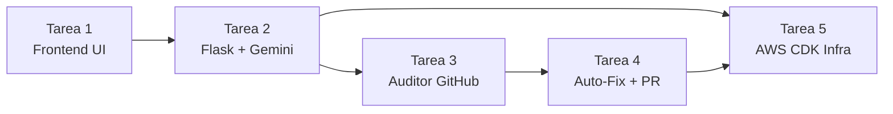

# OmniSpec AI — Plan de Tareas

> Metodología: Ejecución secuencial atómica
> Trazabilidad: Cada tarea vinculada a requisitos EARS (REQ-x.x) y criterios de aceptación (AC-x.x.x)
> Gobernanza: Conforme a `AGENTS.md` — DoD, TDD pytest, commits atómicos

---

## Tarea 1: Interfaz Web Base UI-First

**Scope**: HTML5 + CSS Neón Dark Mode + JavaScript ES6 con sistema de 3 pestañas

**Requisitos cubiertos**: REQ-1.1 (UI streaming), REQ-2.1 (permission modal), REQ-2.5 (score display), REQ-3.1 (diff viewer), REQ-3.3 (write permission modal)

### Subtareas

- [x] 1.1 Crear `frontend/index.html` con estructura semántica HTML5, meta viewport, y CDN imports (marked.js, mermaid.js)
- [x] 1.2 Implementar `frontend/css/neon-dark.css` con variables CSS custom (--neon-cyan, --neon-magenta, --neon-green), dark mode base, y animaciones glow
- [x] 1.3 Construir sistema de pestañas (`TabPanel`) con 3 tabs: SDD Generator, Auditor 3D, Auto-Fix Engine — con indicador neón animado en tab activo
- [x] 1.4 Implementar componente `PermissionModal` reutilizable para diálogos Human-in-the-Loop (Lectura y Escritura)
- [x] 1.5 Implementar componente `StreamingPanel` para renderizado incremental de markdown con `marked.js`
- [x] 1.6 Implementar componente `MermaidBlock` para auto-renderizado de diagramas Mermaid.js
- [x] 1.7 Implementar componente `DiffViewer` con syntax highlighting (líneas verdes/rojas)
- [x] 1.8 Implementar componente `ScoreGauge` — indicador circular SVG 0-100 con colores semáforo (rojo <40, naranja 40-70, verde >70)
- [x] 1.9 Crear `frontend/js/app.js` con módulo principal: tab routing, event listeners, y fetch wrapper para API calls

**Criterios de completitud (DoD)**:
- HTML válido (W3C validator)
- CSS renderiza correctamente en Chrome y Firefox
- Pestañas navegan sin recarga
- marked.js y mermaid.js se cargan y renderizan correctamente desde CDN
- Responsive: funcional en viewport >= 768px

---

## Tarea 2: Backend Flask + SDK Gemini Pro + System Prompt Role-1

**Scope**: API Flask con conexión a Google Gemini Pro y generación SDD EARS

**Requisitos cubiertos**: REQ-1.1 (generación en vivo), REQ-1.2 (EARS syntax), REQ-1.3 (Mermaid diagram), REQ-1.4 (matriz [AMB]/[GAP]), REQ-1.5 (task plan trazable), REQ-1.6 (export ZIP)

### Subtareas

- [x] 2.1 Crear `src/api/app.py` con Flask app factory, CORS config, y error handler centralizado
- [x] 2.2 Crear `src/api/routes/generator.py` con blueprint y endpoints: `POST /api/v1/generate`, `POST /api/v1/generate/export`
- [x] 2.3 Implementar `src/sdd_generator/gemini_client.py` — cliente SDK `google-generativeai` con configuración de modelo (`gemini-1.5-flash`, temperature=0.7, max_output_tokens=8192)
- [x] 2.4 Implementar `src/sdd_generator/generator.py` — orquestador que invoca Gemini Pro con System Prompt Role-1 (Lead Requirements Engineer) y parsea la respuesta estructurada
- [x] 2.5 Implementar `src/sdd_generator/ears_formatter.py` — validador y formateador que asegura sintaxis EARS estricta en output
- [x] 2.6 Crear `src/sdd_generator/templates/sdd_prompt.j2` — template Jinja2 del System Prompt Role-1 con placeholders para contexto del proyecto
- [x] 2.7 Implementar endpoint de exportación ZIP (Pack .kiro): genera archivo con `requirements.md`, `design.md`, `tasks.md`, `AGENTS.md`
- [x] 2.8 Escribir tests: `tests/sdd_generator/test_gemini_client.py` (mock API calls), `tests/sdd_generator/test_generator.py`, `tests/sdd_generator/test_ears_formatter.py`
- [x] 2.9 Verificar: `pytest tests/sdd_generator/ --tb=short -q` — todos los tests pasan

### Subtareas de Verificación — Edge Cases (Tarea 2)

- [x] 2.10 **[AMB-1]** Implementar test `tests/sdd_generator/test_generator_edge_cases.py::test_vague_prompt_under_5_words_generates_sdd` — verificar que input "hacer pagos" NO retorna error y genera SDD con sección [AMB] Contexto Inferido
- [x] 2.11 **[AMB-1]** Implementar test `test_generator_edge_cases.py::test_prompt_expansion_adds_amb_section` — verificar que la respuesta incluye `[AMB] Contexto Inferido` cuando input < 5 palabras
- [x] 2.12 **[GAP-1]** Implementar `src/sdd_generator/smart_engine.py` — Smart Engine local con templates Jinja2 que genera SDD esqueleto sin API externa en < 50 ms
- [x] 2.13 **[GAP-1]** Implementar test `tests/sdd_generator/test_fallback.py::test_missing_api_key_activates_smart_engine` — con `GEMINI_API_KEY=""`, verificar fallback en < 50 ms
- [x] 2.14 **[GAP-1]** Implementar test `test_fallback.py::test_rate_limit_429_uses_dynamo_cache` — mock response 429, verificar que DynamoDB cache se consulta y retorna stale
- [x] 2.15 **[GAP-1]** Implementar test `test_fallback.py::test_rate_limit_429_cache_miss_uses_smart_engine` — mock 429 + cache miss, verificar Smart Engine template en < 50 ms
- [x] 2.16 **[EDGE-1]** Implementar SSE streaming en `src/api/routes/generator.py` con `Response(stream_with_context(...), mimetype='text/event-stream')`
- [x] 2.17 **[EDGE-1]** Implementar test `tests/api/test_streaming_timeout.py::test_sse_sends_chunks_every_5s` — verificar que eventos SSE se emiten con `type: "chunk"`
- [x] 2.18 **[EDGE-1]** Implementar test `test_streaming_timeout.py::test_timeout_warning_at_25s` — verificar evento `{type: "timeout_warning", elapsed: 25}` se emite tras 25s
- [x] 2.19 Verificar: `pytest tests/sdd_generator/test_generator_edge_cases.py tests/sdd_generator/test_fallback.py tests/api/test_streaming_timeout.py --tb=short -q` — todos pasan

**Criterios de completitud (DoD)**:
- Flask app levanta sin errores (`flask run`)
- Endpoint `/api/v1/generate` retorna 200 con SDD válido (mock Gemini en tests)
- EARS formatter valida correctamente los 5 patrones
- Export ZIP contiene los 4 archivos esperados
- Tests coverage >= 80% en módulo `sdd_generator/`
- **[AMB-1]** Input < 5 palabras genera SDD sin error, con sección [AMB] visible
- **[GAP-1]** Sin API Key o con 429, fallback responde en < 50 ms
- **[EDGE-1]** SSE streaming funcional con chunks cada ≤ 5s y timeout_warning a 25s

---

## Tarea 3: Módulo Auditor GitHub + Permiso Lectura + System Prompt Role-2 + Score

**Scope**: Auditoría tridimensional de repos GitHub con Human-in-the-Loop y scoring

**Requisitos cubiertos**: REQ-2.1 (permission protocol), REQ-2.2 (secrets scan), REQ-2.3 (IaC inspection), REQ-2.4 (governance check), REQ-2.5 (weighted score), REQ-2.6 (contextual explanations)

### Subtareas

- [x] 3.1 Crear `src/api/routes/auditor.py` con blueprint y endpoints: `POST /api/v1/audit`, `GET /api/v1/audit/{id}/status`, `GET /api/v1/audit/{id}/report`
- [x] 3.2 Implementar `src/auditor/scanner.py` — orquestador principal que gestiona el flujo de auditoría (permission check → scan → score → explain)
- [x] 3.3 Implementar protocolo Human-in-the-Loop de Permiso de Lectura: validar `permission_granted: true` en request body antes de proceder; loguear decisión con timestamp
- [x] 3.4 Implementar `src/auditor/structural.py` — detector de secretos expuestos con regex patterns: `AKIA[0-9A-Z]{16}`, `password\s*=\s*['"].+['"]`, tokens Bearer/JWT, private keys
- [x] 3.5 Implementar `src/auditor/quality.py` — inspector de IaC AWS: detectar `Action: "*"` en IAM policies, Security Groups con `0.0.0.0/0` en puertos sensibles (22, 3389, 3306)
- [x] 3.6 Implementar `src/auditor/compliance.py` — verificador de gobierno: tags obligatorios (`Environment`, `Owner`, `Project`, `CostCenter`), naming conventions, presencia de README/CHANGELOG/tests
- [x] 3.7 Implementar `src/auditor/report.py` — cálculo de Score Ponderado: `Score = 100 - (secrets_penalty * 0.5 + iac_penalty * 0.3 + gov_penalty * 0.2)` con severidades (crítico=20, alto=10, medio=5, bajo=2)
- [x] 3.8 Integrar Gemini Pro con System Prompt Role-2 (DevSecOps Security Auditor) para generar explicaciones contextuales de riesgo por hallazgo
- [x] 3.9 Escribir tests: `tests/auditor/test_scanner.py`, `tests/auditor/test_structural.py`, `tests/auditor/test_quality.py`, `tests/auditor/test_compliance.py`
- [x] 3.10 Verificar: `pytest tests/auditor/ --tb=short -q` — todos los tests pasan

### Subtareas de Verificación — Edge Cases (Tarea 3)

- [x] 3.11 **[GAP-2]** Implementar test `tests/auditor/test_permission_denied.py::test_read_permission_denied_aborts_audit` — verificar que con `permission_granted: false` NO se ejecuta ninguna llamada a GitHub API
- [x] 3.12 **[GAP-2]** Implementar test `test_permission_denied.py::test_denied_returns_200_with_cancelled_status` — verificar response 200 con `{status: "cancelled", message: "Auditoría cancelada"}`, no error 403
- [x] 3.13 **[GAP-2]** Implementar test `test_permission_denied.py::test_denied_logs_audit_event` — verificar que se loguea `{action_type: "permission_denied", scope: "read"}` en DynamoDB
- [x] 3.14 **[EDGE-2]** Implementar test `tests/auditor/test_empty_repo.py::test_empty_repo_returns_score_na` — repositorio con 0 archivos retorna `{score: null, message: "N/A"}`, sin error 500
- [x] 3.15 **[EDGE-2]** Implementar test `test_empty_repo.py::test_file_over_256kb_is_skipped` — verificar que archivo > 256 KB aparece en sección "Archivos Omitidos" con motivo
- [x] 3.16 **[EDGE-2]** Implementar test `test_empty_repo.py::test_unsupported_formats_only_returns_extensions_list` — repo con solo `.png/.exe` retorna lista de extensiones encontradas
- [x] 3.17 **[EDGE-2]** Implementar lógica de file size check en `src/auditor/scanner.py`: skip files > 256 KB con log warning
- [x] 3.18 **[GAP-1]** Implementar test `tests/auditor/test_scanner.py::test_gemini_429_during_explanation_uses_generic_text` — verificar fallback de explicación genérica cuando Gemini retorna 429 durante Role-2
- [x] 3.19 Implementar test `tests/auditor/test_scanner.py::test_score_clamped_at_zero` — verificar que penalties excesivas producen score = 0 (no negativo)
- [x] 3.20 Verificar: `pytest tests/auditor/test_permission_denied.py tests/auditor/test_empty_repo.py --tb=short -q` — todos pasan

**Criterios de completitud (DoD)**:
- Sin permiso explícito, NO se ejecuta ninguna llamada a GitHub API (AC-2.1.2)
- Detecta correctamente los 3 tipos de secretos definidos en regex patterns
- Detecta IAM `Action: "*"` y SG `0.0.0.0/0` en archivos CloudFormation/CDK
- Score se calcula con fórmula ponderada y devuelve valor 0-100
- Explicaciones Gemini son contextuales al archivo y línea
- Tests coverage >= 80% en módulo `auditor/`
- **[GAP-2]** Permiso denegado retorna 200 OK con status cancelled, no error
- **[EDGE-2]** Repos vacíos retornan score N/A; archivos > 256 KB se omiten con log
- **[GAP-1]** Gemini 429 en explicaciones usa texto genérico sin crash

---

## Tarea 4: Módulo Auto-Fix + Tests pytest + Permiso Escritura + GitHub PR

**Scope**: Generación de parches, tests unitarios, y creación autónoma de Pull Requests

**Requisitos cubiertos**: REQ-3.1 (diff generation), REQ-3.2 (pytest suite), REQ-3.3 (write permission), REQ-3.4 (branch + PR creation), REQ-3.5 (pre-PR validation)

### Subtareas

- [x] 4.1 Crear `src/api/routes/fixer.py` con blueprint y endpoints: `POST /api/v1/fix/generate`, `POST /api/v1/fix/apply`, `GET /api/v1/fix/{id}/status`
- [x] 4.2 Implementar `src/pr_engine/fixer.py` — generador de unified diff patches via Gemini Pro con System Prompt Role-3 (Test Automation Engineer)
- [x] 4.3 Implementar `src/pr_engine/test_generator.py` — generador de `test_security_patch.py` con pytest: test positivo (fix aplicado) + test negativo (vulnerabilidad eliminada)
- [x] 4.4 Implementar protocolo Human-in-the-Loop de Permiso de Escritura: mostrar diff preview + tests preview → requerir `write_permission_granted: true` antes de crear PR; loguear decisión
- [x] 4.5 Implementar `src/pr_engine/validator.py` — ejecuta `pytest test_security_patch.py --tb=short -q` en entorno aislado; solo procede si todos los tests pasan
- [x] 4.6 Implementar `src/pr_engine/pr_creator.py` — `GitHubClient` que: crea rama `fix/omnispec-patch`, aplica diff, commit con formato `fix(security): <desc>`, abre PR via `POST /repos/{owner}/{repo}/pulls`
- [x] 4.7 Implementar fallback: si usuario deniega permiso de escritura, permitir descarga local de diff + tests como archivos
- [x] 4.8 Escribir tests: `tests/pr_engine/test_fixer.py`, `tests/pr_engine/test_test_generator.py`, `tests/pr_engine/test_pr_creator.py`, `tests/pr_engine/test_validator.py`
- [x] 4.9 Verificar: `pytest tests/pr_engine/ --tb=short -q` — todos los tests pasan

### Subtareas de Verificación — Edge Cases (Tarea 4)

- [x] 4.10 **[GAP-2]** Implementar test `tests/pr_engine/test_permission_denied.py::test_write_permission_denied_blocks_pr_creation` — verificar que con `write_permission_granted: false` NO se ejecuta ninguna operación de escritura en GitHub
- [x] 4.11 **[GAP-2]** Implementar test `test_permission_denied.py::test_denied_enables_local_download` — verificar que al denegar permiso, response incluye `{download_available: true, diff_content: "...", test_content: "..."}`
- [x] 4.12 **[GAP-2]** Implementar test `test_permission_denied.py::test_denied_logs_write_permission_event` — verificar log `{action_type: "permission_denied", scope: "write"}` en DynamoDB
- [x] 4.13 **[GAP-1]** Implementar test `tests/pr_engine/test_fixer.py::test_gemini_429_during_fix_generation` — verificar comportamiento cuando Gemini retorna 429 al generar diff (retry x1 → error informativo)
- [x] 4.14 **[EDGE-1]** Implementar test `tests/pr_engine/test_fixer.py::test_fix_generation_timeout_returns_partial` — verificar que generaciones > 25s emiten timeout_warning y completan con resultado parcial
- [x] 4.15 Implementar test `tests/pr_engine/test_pr_creator.py::test_branch_already_exists_appends_timestamp` — verificar que si `fix/omnispec-patch` ya existe, se crea `fix/omnispec-patch-{timestamp}`
- [x] 4.16 Implementar test `tests/pr_engine/test_pr_creator.py::test_github_token_missing_scope_returns_helpful_error` — verificar que 403 por scope insuficiente retorna instrucciones claras al usuario
- [x] 4.17 Implementar test `tests/pr_engine/test_validator.py::test_pytest_failure_blocks_pr_and_shows_output` — verificar que tests fallidos bloquean PR y retornan stdout/stderr completo de pytest
- [x] 4.18 Implementar test `tests/pr_engine/test_fixer.py::test_invalid_diff_triggers_regeneration` — verificar que `git apply --check` failure dispara re-generación con contexto de error
- [x] 4.19 Verificar: `pytest tests/pr_engine/test_permission_denied.py tests/pr_engine/test_fixer.py tests/pr_engine/test_pr_creator.py tests/pr_engine/test_validator.py --tb=short -q` — todos pasan

**Criterios de completitud (DoD)**:
- Diff generado es aplicable con `git apply` (formato unified diff válido)
- `test_security_patch.py` ejecuta sin errores de import con pytest
- Sin permiso explícito de escritura, NO se crea rama ni PR (AC-3.3.2)
- PR body incluye: hallazgos, diff, y resultados de tests
- Si tests fallan, el sistema NO crea el PR y muestra output de pytest (AC-3.5.2)
- Tests coverage >= 80% en módulo `pr_engine/`
- **[GAP-2]** Permiso denegado habilita descarga local y loguea evento
- **[GAP-1]** Gemini 429 durante fix retorna error informativo sin crash
- **[EDGE-1]** Timeout en generación retorna resultado parcial con warning
- Branch naming con fallback timestamp evita conflictos 422

---

## Tarea 5: Infraestructura Serverless AWS CDK

**Scope**: Despliegue serverless con API Gateway, Lambda Python 3.11, serverless-wsgi, y DynamoDB

**Requisitos cubiertos**: REQ-1.1 (AC-1.1.3 — DynamoDB fallback), REQ-2.1 (AC-2.1.3 — audit log), Design Doc §4 (Cache strategy)

### Subtareas

- [x] 5.1 Crear `infra/app.py` — CDK App entry point con environment config (account, region)
- [x] 5.2 Implementar `infra/stacks/api_stack.py` — API Gateway REST + Lambda Python 3.11 con `serverless-wsgi` adapter, environment variables (GEMINI_API_KEY, GITHUB_TOKEN desde Secrets Manager)
- [x] 5.3 Implementar `infra/stacks/storage_stack.py` — DynamoDB tables: `omnispec-cache` (pk: CACHE#hash, sk: v#version, TTL enabled) y `omnispec-audit-log` (pk: USER#id, sk: ACTION#timestamp)
- [x] 5.4 Configurar IAM roles con mínimo privilegio: Lambda solo accede a sus tablas DynamoDB específicas, Secrets Manager read-only para API keys
- [x] 5.5 Crear `infra/stacks/auth_stack.py` — API Key management para rate limiting y autenticación de requests
- [x] 5.6 Configurar DynamoDB TTL en atributo `ttl` para expiración automática de cache entries
- [x] 5.7 Crear `infra/cdk.json` con configuración de app, context values, y feature flags
- [x] 5.8 Escribir `pyproject.toml` en raíz con dependencias del proyecto (flask, google-generativeai, boto3, aws-cdk-lib, pytest, ruff, mypy)
- [x] 5.9 Verificar: `cdk synth` genera template CloudFormation válido sin errores

> **Nota de implementación**: Se usó SAM (template.yaml) en vez de CDK por simplicidad de deploy.
> Lambda empaquetada como Container Image (Dockerfile) con Python 3.12 y serverless-wsgi.
> Secrets inyectados desde SSM Parameter Store (no Secrets Manager, más económico).

**Criterios de completitud (DoD)**:
- `cdk synth` produce template CloudFormation válido
- Lambda configurada con Python 3.11 runtime y serverless-wsgi
- DynamoDB tables tienen TTL habilitado y billing mode PAY_PER_REQUEST
- IAM policies siguen principio de mínimo privilegio (no `Action: "*"`)
- Secrets Manager references en environment variables (no hardcoded keys)
- Infraestructura es reproducible: `cdk deploy` crea todo el stack desde cero

---

## Orden de Ejecución y Dependencias



| Tarea | Depende de | Bloquea a |
|-------|-----------|-----------|
| Tarea 1 | — (independiente) | Tarea 2 (API consume UI) |
| Tarea 2 | Tarea 1 (endpoints para UI) | Tarea 3, Tarea 5 |
| Tarea 3 | Tarea 2 (Gemini client reutilizado) | Tarea 4 |
| Tarea 4 | Tarea 3 (findings como input) | Tarea 5 |
| Tarea 5 | Tarea 2, Tarea 4 (código completo para deploy) | — |

---

## Resumen de Trazabilidad

| Tarea | Requisitos EARS | Criterios AC | Edge Cases | Módulo |
|-------|----------------|-------------|------------|--------|
| Tarea 1 | REQ-1.1, REQ-2.1, REQ-2.5, REQ-3.1, REQ-3.3 | AC-1.3.1, AC-2.1.1, AC-2.5.3, AC-3.1.3, AC-3.3.1 | — | frontend/ |
| Tarea 2 | REQ-1.1 → REQ-1.6 | AC-1.1.1 → AC-1.6.3, AC-AMB-1.x, AC-GAP-1.x, AC-EDGE-1.x | AMB-1, GAP-1, EDGE-1 | src/sdd_generator/, src/api/ |
| Tarea 3 | REQ-2.1 → REQ-2.6 | AC-2.1.1 → AC-2.6.3, AC-GAP-2.x, AC-EDGE-2.x | GAP-1, GAP-2, EDGE-2 | src/auditor/ |
| Tarea 4 | REQ-3.1 → REQ-3.5 | AC-3.1.1 → AC-3.5.3, AC-GAP-2.x, AC-EDGE-1.x | GAP-1, GAP-2, EDGE-1 | src/pr_engine/ |
| Tarea 5 | REQ-1.1 (cache), REQ-2.1 (log) | AC-1.1.3, AC-2.1.3 | GAP-1 (infra cache) | infra/ |

---

## Resumen de Tests de Edge Cases

| ID | Test File | Test Functions | Tarea |
|----|-----------|---------------|-------|
| AMB-1 | `tests/sdd_generator/test_generator_edge_cases.py` | `test_vague_prompt_under_5_words_generates_sdd`, `test_prompt_expansion_adds_amb_section` | T2 |
| GAP-1 | `tests/sdd_generator/test_fallback.py` | `test_missing_api_key_activates_smart_engine`, `test_rate_limit_429_uses_dynamo_cache`, `test_rate_limit_429_cache_miss_uses_smart_engine` | T2 |
| GAP-1 | `tests/auditor/test_scanner.py` | `test_gemini_429_during_explanation_uses_generic_text` | T3 |
| GAP-1 | `tests/pr_engine/test_fixer.py` | `test_gemini_429_during_fix_generation` | T4 |
| GAP-2 | `tests/auditor/test_permission_denied.py` | `test_read_permission_denied_aborts_audit`, `test_denied_returns_200_with_cancelled_status`, `test_denied_logs_audit_event` | T3 |
| GAP-2 | `tests/pr_engine/test_permission_denied.py` | `test_write_permission_denied_blocks_pr_creation`, `test_denied_enables_local_download`, `test_denied_logs_write_permission_event` | T4 |
| EDGE-1 | `tests/api/test_streaming_timeout.py` | `test_sse_sends_chunks_every_5s`, `test_timeout_warning_at_25s` | T2 |
| EDGE-1 | `tests/pr_engine/test_fixer.py` | `test_fix_generation_timeout_returns_partial` | T4 |
| EDGE-2 | `tests/auditor/test_empty_repo.py` | `test_empty_repo_returns_score_na`, `test_file_over_256kb_is_skipped`, `test_unsupported_formats_only_returns_extensions_list` | T3 |

---

## Tarea 6: Deuda Técnica — Migración de WSGI Adapter: serverless-wsgi → Mangum

**Scope**: Migración del adapter Lambda de serverless-wsgi a Mangum para mejor soporte de Flask moderno, SSE Streaming y ASGI.

**Justificación**: Mangum tiene mejor soporte para Flask moderno (3.x), manejo nativo de Server-Sent Events (SSE) para streaming del Auditor 3D y generación SDD, y es el adapter recomendado por la comunidad para frameworks Python en Lambda. serverless-wsgi está en mantenimiento mínimo.

**Prioridad**: Baja (no bloqueante — serverless-wsgi funciona correctamente para el MVP)

### Subtareas

- [x] 6.1 Reemplazar `serverless-wsgi` por `mangum>=0.17` en `requirements.txt`
- [x] 6.2 Actualizar `src/api/lambda_handler.py`:
  ```python
  from mangum import Mangum
  from src.api.app import create_app
  app = create_app()
  handler = Mangum(app, lifespan="off")
  ```
- [x] 6.3 Verificar compatibilidad Flask 3.x + Mangum (WSGI-to-ASGI wrapper requerido si Mangum no lo hace nativo)
- [x] 6.4 Ejecutar `pytest tests/infra/ -v` y confirmar que los 6 tests pasen
- [ ] 6.5 Verificar SSE streaming en `/api/v1/audit/stream` funciona via API Gateway HTTP API
- [ ] 6.6 Deploy de prueba con `sam build && sam deploy` y validar health check

**Criterios de completitud (DoD)**:
- Lambda responde correctamente con Mangum como adapter
- SSE streaming funciona end-to-end (auditoría progresiva)
- Los 197+ tests unitarios pasan sin modificación
- `sam deploy` exitoso sin errores

---

## Tarea 7: CI/CD Pipeline con GitHub Actions

**Scope**: Automatizar tests, build y deploy a AWS en cada push/merge a main.

**Justificación**: Eliminar deploys manuales, garantizar que código roto no llegue a producción, y habilitar flujo profesional de desarrollo colaborativo.

### Subtareas

- [ ] 7.1 Crear `.github/workflows/ci.yml` — Pipeline de Integración Continua:
  - Trigger: Pull Request a `main`
  - Steps: checkout → setup Python 3.12 → install deps → `pytest` (197+ tests) → `ruff check`
  - Si falla: bloquea el merge del PR

- [ ] 7.2 Crear `.github/workflows/cd.yml` — Pipeline de Deploy Continuo:
  - Trigger: Push a `main` (después del merge)
  - Steps: checkout → setup Python 3.12 → configure AWS credentials → `sam build` → `sam deploy` → `aws s3 sync frontend/` → `aws cloudfront create-invalidation`
  - Secrets de GitHub: `AWS_ACCESS_KEY_ID`, `AWS_SECRET_ACCESS_KEY`, `AWS_REGION`

- [ ] 7.3 Configurar GitHub Secrets en el repositorio:
  - `AWS_ACCESS_KEY_ID` (IAM user con permisos de deploy)
  - `AWS_SECRET_ACCESS_KEY`
  - `AWS_REGION` = `us-east-1`

- [ ] 7.4 Crear IAM User `omnispec-deployer` con política mínima:
  - CloudFormation, Lambda, API Gateway, S3, DynamoDB, ECR, CloudFront, IAM (create roles), SSM (read)

- [ ] 7.5 Configurar branch protection en `main`:
  - Requerir PR para merge (no push directo)
  - Requerir que CI pase antes de merge

- [ ] 7.6 Verificar pipeline end-to-end:
  - Crear PR con cambio menor → CI pasa → merge → CD despliega automáticamente

**Criterios de completitud (DoD)**:
- Push directo a `main` está bloqueado (requiere PR)
- Cada PR ejecuta tests automáticamente
- Si los tests fallan, el PR no se puede mergear
- Cada merge a `main` despliega automáticamente a producción
- El deploy incluye: Lambda + frontend S3 + invalidación CloudFront
- Secrets de AWS NO están en el código (solo en GitHub Secrets)
