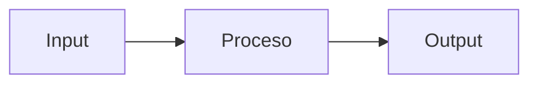

# AGENTS.md — OmniSpec AI

## Definition of Done (DoD)

Una tarea se considera **completada** cuando cumple TODOS los siguientes criterios:

1. El código compila/ejecuta sin errores.
2. Todos los tests unitarios pasan (`pytest --tb=short -q`).
3. La cobertura de tests no disminuye respecto a la rama principal.
4. El código sigue las convenciones del proyecto (ver sección de reglas).
5. No se introducen dependencias nuevas sin justificación documentada.
6. Los cambios están commiteados en una rama feature con mensaje descriptivo.
7. Si aplica, la documentación se actualiza junto al código.

---

## Reglas TDD (pytest)

- **Red-Green-Refactor**: Escribe el test que falla primero, implementa el mínimo código para que pase, luego refactoriza.
- Framework obligatorio: `pytest` con fixtures y parametrize cuando aplique.
- Estructura de tests: espejo de `src/` dentro de `tests/` (e.g., `src/auditor/scanner.py` → `tests/auditor/test_scanner.py`).
- Naming: `test_<función>_<escenario>_<resultado_esperado>`.
- Mocks: usar `unittest.mock` o `pytest-mock` para dependencias externas (APIs, DB).
- Cobertura mínima objetivo: 80% por módulo.
- Ejecutar tests antes de cada commit: `pytest --tb=short -q`.

---

## Sintaxis EARS Obligatoria para Especificaciones

Todas las especificaciones funcionales DEBEN usar la sintaxis **EARS** (Easy Approach to Requirements Syntax):

| Patrón | Plantilla |
|--------|-----------|
| Ubiquitous | The system shall `<response>`. |
| Event-Driven | When `<trigger>`, the system shall `<response>`. |
| State-Driven | While `<state>`, the system shall `<response>`. |
| Unwanted Behavior | If `<condition>`, then the system shall `<response>`. |
| Optional Feature | Where `<feature>` is supported, the system shall `<response>`. |
| Complex | When `<trigger>`, while `<state>`, the system shall `<response>`. |

### Ejemplo

```
When the user submits a GitHub repository URL,
the system shall analyze all .py files and generate
an SDD-compliant specification using EARS syntax.
```

---

## Reglas de Desarrollo Agéntico

1. **Autonomía acotada**: El agente ejecuta tareas definidas en el task list sin desviarse del scope.
2. **Verificación continua**: Después de cada cambio, ejecutar build/tests para validar.
3. **Fail-fast**: Si un approach falla 2 veces, diagnosticar root cause y proponer alternativa.
4. **No gold-plating**: Implementar exactamente lo pedido, sin features adicionales no solicitadas.
5. **Trazabilidad**: Cada archivo creado o modificado debe estar vinculado a una tarea del backlog.
6. **Seguridad por defecto**: Validar inputs, usar queries parametrizadas, manejar errores explícitamente.
7. **Commits atómicos**: Un commit por unidad lógica de cambio, nunca mezclar features.
8. **Branch strategy**: Feature branches desde `main`, PRs con descripción clara del cambio.
9. **Documentación inline**: Docstrings en funciones públicas, type hints obligatorios.
10. **Principio de mínimo privilegio**: Cada módulo accede solo a los recursos que necesita.

---

## Plantilla Oficial de Commits (Conventional Commits)

Todos los commits DEBEN seguir el formato:

```
<tipo>(<módulo>): <descripción corta en presente>
```

### Tipos Permitidos

| Tipo | Uso |
|------|-----|
| `feat` | Nueva característica o funcionalidad |
| `fix` | Corrección de bug o defecto |
| `test` | Adición o modificación de pruebas unitarias |
| `docs` | Documentación, specs, steering, o README |
| `refactor` | Mejora de código sin cambio funcional |
| `infra` | Cambios en AWS CDK, stacks, o configuración de infraestructura |

### Módulos Válidos

`sdd_generator`, `auditor`, `pr_engine`, `api`, `frontend`, `infra`, `tests`, `root`

### Reglas

1. La descripción es en **presente imperativo** (e.g., "integra", no "integró" ni "integrando").
2. Máximo 72 caracteres en la primera línea.
3. Si se requiere detalle adicional, dejar una línea en blanco y agregar cuerpo descriptivo.
4. Referenciar requisitos EARS cuando aplique: `Refs: REQ-1.1, AC-1.1.1`.

### Ejemplos

```
feat(sdd_generator): integra Google Gemini Pro SDK gemini-1.5-flash

Refs: REQ-1.1, AC-1.1.1
```

```
fix(auditor): corrige cálculo de score cuando penalties exceden 100

Clamp score a rango [0, 100] para evitar valores negativos.
Refs: EDGE-2, AC-2.5.1
```

```
test(pr_engine): agrega tests de permiso de escritura denegado

Cubre escenarios GAP-2: download habilitado y log en DynamoDB.
Refs: AC-GAP-2.4, AC-GAP-2.5
```

```
infra(infra): configura DynamoDB TTL en tabla omnispec-cache
```

---

## Plantilla Estándar para Documentación y Readmes

Todo archivo markdown de documentación o README de módulo DEBE seguir esta estructura:

### Estructura Requerida

```markdown
# <Título del Módulo>

 

## Resumen Ejecutivo

Descripción concisa del propósito del módulo en 2-3 oraciones.

## Arquitectura / Flujo



## Funcionalidades / Requisitos

| ID | Funcionalidad | Estado |
|----|--------------|--------|
| REQ-x.x | Descripción | ✅ / 🔄 / ❌ |

## Ejecución y Pruebas

```bash
# Ejecutar tests del módulo
pytest tests/<módulo>/ -v

# Ejecutar con cobertura
pytest tests/<módulo>/ --cov=src/<módulo> --cov-report=term-missing
```

## Dependencias

- Listar dependencias internas y externas relevantes.
```

### Reglas de Documentación

1. **Mermaid.js obligatorio**: Todo módulo debe incluir al menos un diagrama de flujo o arquitectura.
2. **Tabla de requisitos**: Vincular funcionalidades a IDs de `requirements.md` (REQ-x.x).
3. **Badges de estado**: Indicar estado de implementación (✅ completo, 🔄 en progreso, ❌ pendiente).
4. **Instrucciones de test**: Siempre incluir el comando `pytest` específico del módulo.
5. **Sin prosa innecesaria**: Preferir tablas, bullets y diagramas sobre párrafos extensos.

---

## Estándar de Calidad de Código Python

### Type Hints Obligatorios

Todas las funciones y métodos públicos DEBEN incluir type hints en la firma:

```python
# Correcto
def generate_sdd(prompt: str, model: str = "gemini-1.5-flash") -> dict[str, Any]:
    ...

# Correcto — con tipos complejos
def scan_repository(repo_url: str, file_types: list[str]) -> tuple[list[Finding], float]:
    ...

# Incorrecto — falta type hints
def generate_sdd(prompt, model="gemini-1.5-flash"):
    ...
```

### Reglas de Type Hints

1. Parámetros: tipo explícito para todos los parámetros públicos.
2. Return: tipo de retorno siempre declarado (usar `-> None` si no retorna).
3. Valores por defecto: el tipo se infiere pero DEBE declararse igualmente.
4. Colecciones: usar `list[T]`, `dict[K, V]`, `tuple[T, ...]` (no `List`, `Dict` de `typing`).
5. Opcionales: usar `X | None` (no `Optional[X]`).
6. Funciones internas/privadas (`_prefix`): type hints recomendados pero no obligatorios.

### Docstrings — Formato Google Style

Módulos, clases y funciones públicas DEBEN incluir docstrings en formato Google:

```python
"""Genera una especificación SDD completa usando Google Gemini Pro.

Este módulo orquesta la generación de documentos SDD con requisitos
en sintaxis EARS, diagramas Mermaid y matrices de decisión.

Attributes:
    DEFAULT_MODEL: Modelo Gemini Pro por defecto.
    MAX_RETRIES: Número máximo de reintentos ante error de API.
"""


def generate_sdd(prompt: str, model: str = "gemini-1.5-flash") -> dict[str, Any]:
    """Genera un documento SDD a partir de la descripción del proyecto.

    Invoca Google Gemini Pro con el System Prompt Role-1 y parsea
    la respuesta en secciones estructuradas.

    Args:
        prompt: Descripción del proyecto o URL de repositorio GitHub.
        model: Identificador del modelo Gemini a usar.

    Returns:
        Diccionario con claves: 'requirements', 'diagram', 'matrix', 'tasks'.

    Raises:
        RateLimitError: Si Gemini Pro retorna HTTP 429.
        MissingAPIKeyError: Si GEMINI_API_KEY no está configurada.

    Example:
        >>> result = generate_sdd("Sistema de pagos e-commerce")
        >>> assert 'requirements' in result
    """
```

### Reglas de Docstrings

1. **Módulos**: Primera línea resumen + descripción extendida + Attributes si aplica.
2. **Clases**: Resumen + descripción + Attributes de instancia.
3. **Funciones públicas**: Resumen + Args + Returns + Raises + Example (opcional).
4. **Funciones privadas** (`_prefix`): Docstring de una línea recomendado.
5. **Longitud**: Primera línea ≤ 79 caracteres. Descripción extendida sin límite.

### Linting y Verificación

```bash
# Verificar type hints
mypy src/ --strict

# Verificar estilo y linting
ruff check src/ tests/

# Formatear código
ruff format src/ tests/
```
