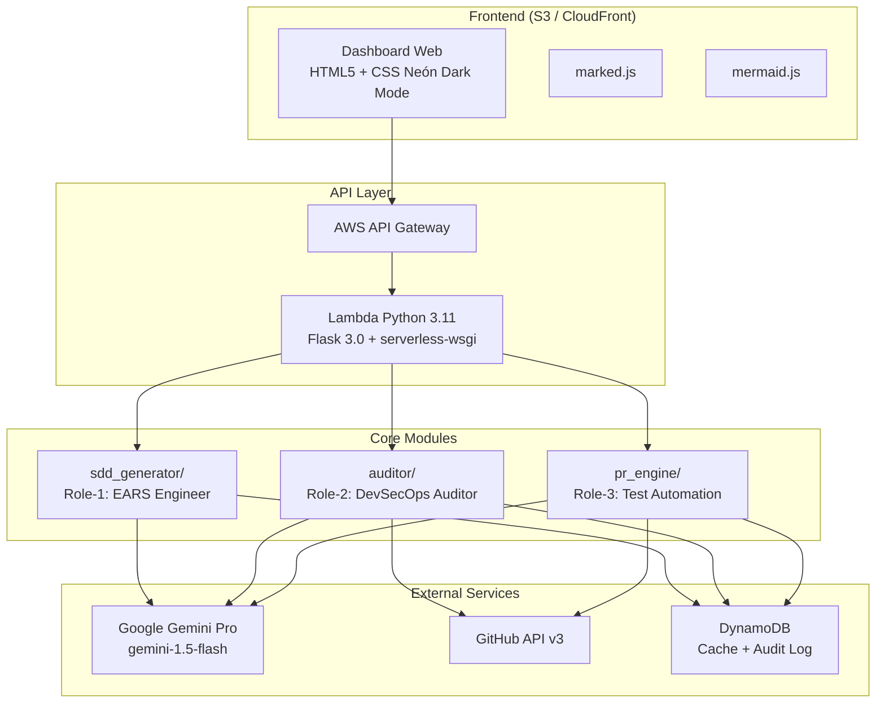

# OmniSpec AI

  

## Resumen Ejecutivo

Plataforma Agéntica de Ingeniería SDD y Seguridad Serverless AWS con Google Gemini Pro. Automatiza la generación de especificaciones EARS, auditoría tridimensional de repositorios GitHub con protocolos Human-in-the-Loop, y creación autónoma de Pull Requests con tests unitarios pytest.

## Arquitectura



## Funcionalidades / Requisitos

| ID | Módulo | Funcionalidad | Estado |
|----|--------|--------------|--------|
| REQ-1.1 | sdd_generator | Generación en vivo con Gemini Pro (streaming SSE) | 🔄 |
| REQ-1.2 | sdd_generator | Requisitos funcionales en sintaxis EARS estricta | 🔄 |
| REQ-1.3 | sdd_generator | Diagrama AWS Mermaid.js auto-generado | 🔄 |
| REQ-1.4 | sdd_generator | Matriz de Decisiones [AMB]/[GAP] | 🔄 |
| REQ-1.5 | sdd_generator | Plan de tareas trazables vinculado a REQ-x.x | 🔄 |
| REQ-1.6 | sdd_generator | Exportación Pack `.kiro` (ZIP) | 🔄 |
| REQ-2.1 | auditor | Protocolo Human-in-the-Loop: Permiso de Lectura | 🔄 |
| REQ-2.2 | auditor | Inspección de secretos expuestos (AWS keys, passwords) | 🔄 |
| REQ-2.3 | auditor | Inspección IaC AWS (IAM `Action:*`, SG abiertos) | 🔄 |
| REQ-2.4 | auditor | Inspección de Gobierno (tags, naming, docs) | 🔄 |
| REQ-2.5 | auditor | Score de Seguridad Ponderado (0-100) | 🔄 |
| REQ-2.6 | auditor | Explicaciones contextuales de riesgo con Gemini | 🔄 |
| REQ-3.1 | pr_engine | Generación de parche de código (unified diff) | 🔄 |
| REQ-3.2 | pr_engine | Suite de tests pytest `test_security_patch.py` | 🔄 |
| REQ-3.3 | pr_engine | Protocolo Human-in-the-Loop: Permiso de Escritura | 🔄 |
| REQ-3.4 | pr_engine | Creación autónoma de rama + Pull Request | 🔄 |
| REQ-3.5 | pr_engine | Validación pre-PR con pytest (gate obligatorio) | 🔄 |

## Stack Tecnológico

| Capa | Tecnología |
|------|-----------|
| Lenguaje | Python 3.11 |
| IA | Google Gemini Pro (`google-generativeai`) — modelo `gemini-1.5-flash` |
| Backend | Flask 3.0 + serverless-wsgi |
| Infraestructura | AWS CDK, Lambda, DynamoDB, API Gateway, S3 |
| Frontend | HTML5, Vanilla CSS (Neón Dark Mode), JavaScript ES6, marked.js, mermaid.js |
| Testing | pytest, pytest-mock, pytest-cov, ruff, mypy |

## Estructura del Proyecto

```
omnispec-ai/
├── AGENTS.md               # Gobernanza agéntica, DoD, estándares
├── README.md               # Este archivo
├── src/
│   ├── sdd_generator/      # Modo 1: Generador SDD EARS
│   ├── auditor/            # Modo 2: Auditoría 3D GitHub
│   ├── pr_engine/          # Modo 3: Auto-Fix + PR
│   └── api/                # Capa API Flask
├── tests/                  # Tests unitarios (espejo de src/)
├── infra/                  # AWS CDK Infrastructure
├── frontend/               # Dashboard Web (Neón Dark Mode)
└── .kiro/
    ├── steering/           # Documentos de gobernanza del agente
    └── specs/app/          # Especificación técnica SDD
```

## Ejecución y Pruebas

```bash
# Crear entorno virtual
python3.11 -m venv .venv
source .venv/bin/activate

# Instalar dependencias
pip install -e ".[dev]"

# Configurar variables de entorno
cp .env.example .env
# Editar .env con GEMINI_API_KEY y GITHUB_TOKEN

# Ejecutar todos los tests
pytest -v

# Ejecutar tests con cobertura
pytest --cov=src --cov-report=term-missing -v

# Ejecutar tests de un módulo específico
pytest tests/sdd_generator/ -v
pytest tests/auditor/ -v
pytest tests/pr_engine/ -v

# Linting y type checking
ruff check src/ tests/
mypy src/ --strict

# Ejecutar servidor de desarrollo
python -m src.api.app
```

## Dependencias

- **google-generativeai**: SDK oficial de Google Gemini Pro
- **Flask 3.0**: Framework web para API REST
- **serverless-wsgi**: Adaptador WSGI para AWS Lambda
- **boto3**: SDK de AWS para DynamoDB y Secrets Manager
- **aws-cdk-lib**: Infraestructura como código
- **pytest / pytest-mock / pytest-cov**: Framework de testing
- **ruff**: Linter y formateador Python
- **mypy**: Type checking estático

## Documentación

| Documento | Ruta | Contenido |
|-----------|------|-----------|
| Gobernanza Agéntica | [`AGENTS.md`](./AGENTS.md) | DoD, TDD, EARS, commits, code standards |
| Producto | [`.kiro/steering/product.md`](./.kiro/steering/product.md) | Definición de los 3 modos |
| Stack Técnico | [`.kiro/steering/tech.md`](./.kiro/steering/tech.md) | Tecnologías y versiones |
| Estructura | [`.kiro/steering/structure.md`](./.kiro/steering/structure.md) | Layout modular del repo |
| Requisitos EARS | [`.kiro/specs/app/requirements.md`](./.kiro/specs/app/requirements.md) | 17 requisitos + edge cases |
| Diseño | [`.kiro/specs/app/design.md`](./.kiro/specs/app/design.md) | Arquitectura, prompts, resiliencia |
| Plan de Tareas | [`.kiro/specs/app/tasks.md`](./.kiro/specs/app/tasks.md) | 5 tareas + 76 subtareas |

## Licencia

Propietario. Todos los derechos reservados.
