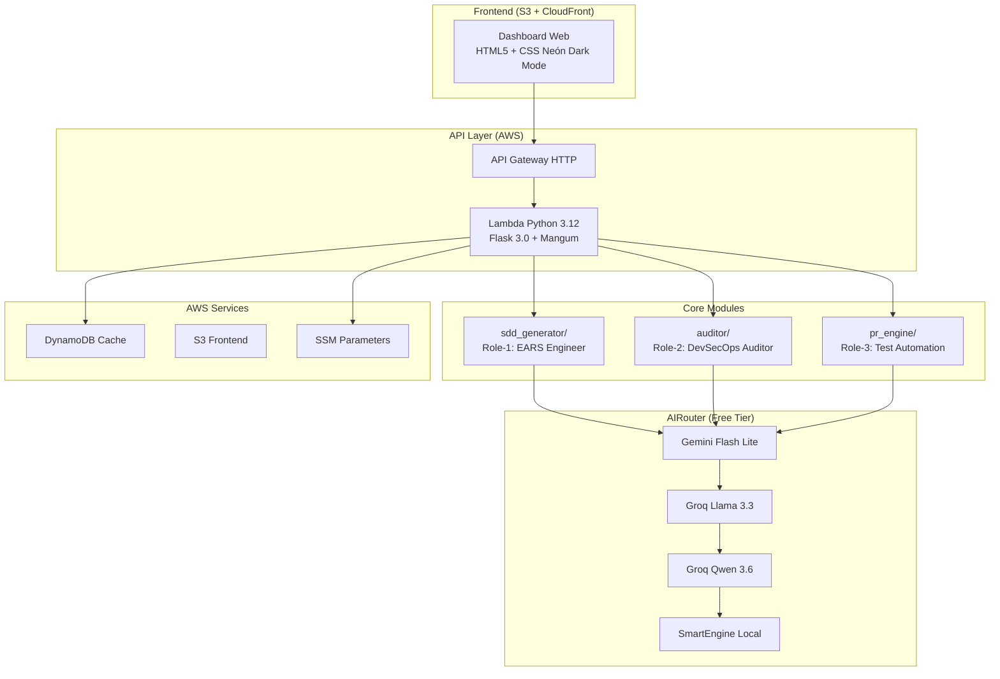

# OmniSpec AI

   

## Resumen Ejecutivo

Plataforma Agéntica de Ingeniería SDD y Seguridad Serverless AWS con Google Gemini Pro. Automatiza la generación de especificaciones EARS, auditoría tridimensional de repositorios GitHub con protocolos Human-in-the-Loop, y creación autónoma de Pull Requests con tests unitarios pytest.

## Producción

| Recurso | URL |
|---------|-----|
| **Frontend** | https://d140eqoid6qg8h.cloudfront.net |
| **API** | https://pbamtxrcw5.execute-api.us-east-1.amazonaws.com/ |

## Arquitectura



## Módulos

| Módulo | Función | Estado |
|--------|---------|--------|
| **SDD Generator** | Genera especificaciones EARS + design + tasks con IA. Exporta Pack `.kiro` (ZIP) | ✅ |
| **Auditor 3D** | Audita repos GitHub: secretos, IaC insegura, gobierno. Score 0-100 con animación progresiva | ✅ |
| **Auto-Fix Engine** | Genera fixes + tests pytest. Crea PRs con descripciones generadas por IA | ✅ |

## AIRouter Multi-Proveedor

Failover automático entre proveedores gratuitos:

| Nivel | Proveedor | Modelo | Cuota |
|-------|-----------|--------|-------|
| 1 | Gemini | `gemini-flash-lite-latest` | Free (generosa) |
| 2 | Groq-Llama | `llama-3.3-70b-versatile` | Free 30 req/min |
| 3 | Groq-Qwen | `qwen/qwen3.6-27b` | Free |
| 4 | Groq-GPT-OSS | `openai/gpt-oss-120b` | Free |
| 5 | SmartEngine | Jinja2 local | Ilimitado < 50ms |

## Stack Tecnológico

| Capa | Tecnología |
|------|-----------|
| Lenguaje | Python 3.12 |
| IA | Google Gemini, Groq (Llama/Qwen/GPT-OSS) |
| Backend | Flask 3.0 + Mangum + asgiref |
| Infra | AWS SAM, Lambda, API Gateway, DynamoDB, S3, CloudFront, SSM |
| Frontend | HTML5, Vanilla CSS (Neón Dark Mode), JavaScript ES6 |
| Testing | pytest (197 tests), ruff |
| CI/CD | GitHub Actions (CI en PR, CD en merge a main) |

## Ejecución Local

```bash
# Clonar y activar entorno
git clone https://github.com/wigsdev/omnispec-ai
cd omnispec-ai
python3.12 -m venv .venv && source .venv/bin/activate
pip install -r requirements.txt
pip install pytest

# Configurar variables de entorno
cp .env.example .env
# Editar .env con GEMINI_API_KEY, GROQ_API_KEY, GITHUB_OAUTH_CLIENT_ID/SECRET, FLASK_SECRET_KEY

# Ejecutar tests
pytest -v

# Ejecutar servidor local
python -m src.api.app
# Abre http://localhost:5000
```

## Deploy a AWS

```bash
# 1. Configurar secretos en SSM
./scripts/setup_ssm_params.sh

# 2. Build + Deploy
sam build --use-container && ./scripts/deploy.sh prod
```

## CI/CD

| Pipeline | Trigger | Pasos |
|----------|---------|-------|
| **CI** | Pull Request → main | pytest + ruff + sam validate |
| **CD** | Push → main (merge) | sam build → deploy → s3 sync → cloudfront invalidation |

## Estructura

```
omnispec-ai/
├── src/
│   ├── sdd_generator/   # SDD + EARS + AIRouter
│   ├── auditor/         # Auditoría 3D + GitHubFetcher
│   ├── pr_engine/       # Auto-Fix + PRCreator
│   └── api/             # Flask + Lambda handler
├── tests/               # 197 tests unitarios
├── frontend/            # Dashboard Neón Dark Mode
├── .github/workflows/   # CI/CD GitHub Actions
├── template.yaml        # SAM CloudFormation
├── Dockerfile           # Container Lambda Python 3.12
└── scripts/             # deploy.sh, setup_ssm_params.sh
```

## Documentación

| Documento | Ruta | Contenido |
|-----------|------|-----------|
| Gobernanza | [`AGENTS.md`](./AGENTS.md) | DoD, TDD, EARS, commits |
| Producto | [`.kiro/steering/product.md`](./.kiro/steering/product.md) | 3 modos |
| Stack | [`.kiro/steering/tech.md`](./.kiro/steering/tech.md) | Tecnologías |
| Requisitos EARS | [`.kiro/specs/app/requirements.md`](./.kiro/specs/app/requirements.md) | 17 requisitos |
| Diseño | [`.kiro/specs/app/design.md`](./.kiro/specs/app/design.md) | Arquitectura |
| Tareas | [`.kiro/specs/app/tasks.md`](./.kiro/specs/app/tasks.md) | 7 tareas completadas |
| Changelog | [`CHANGELOG.md`](./CHANGELOG.md) | Historial de versiones |
